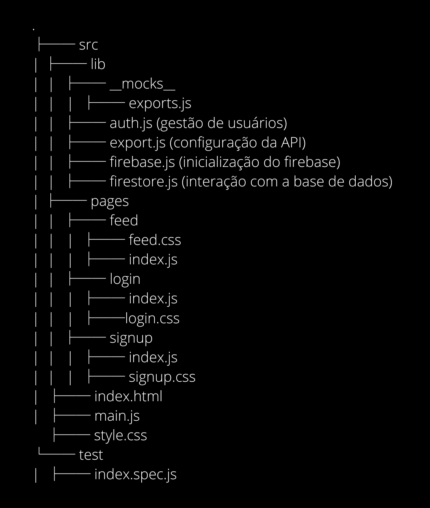
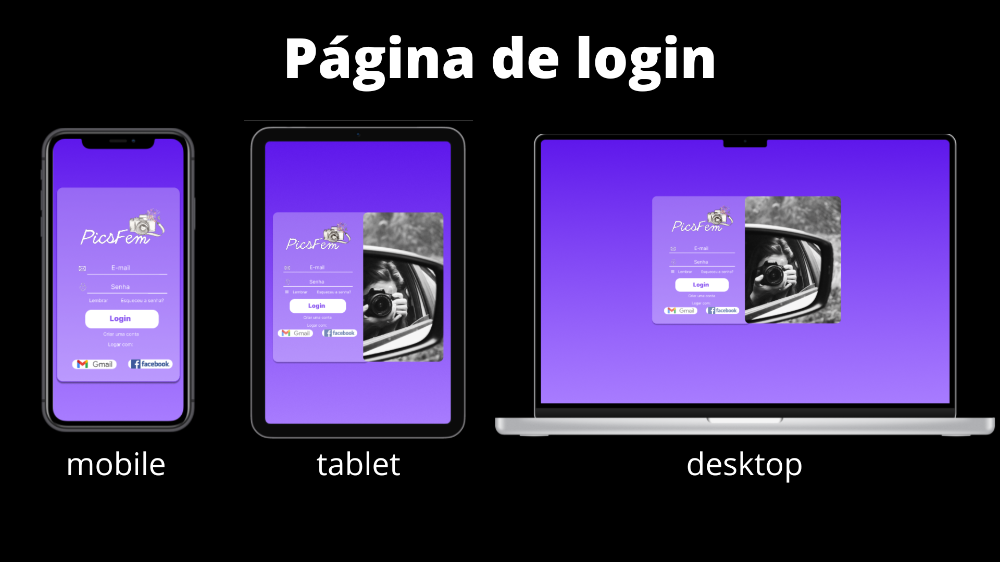
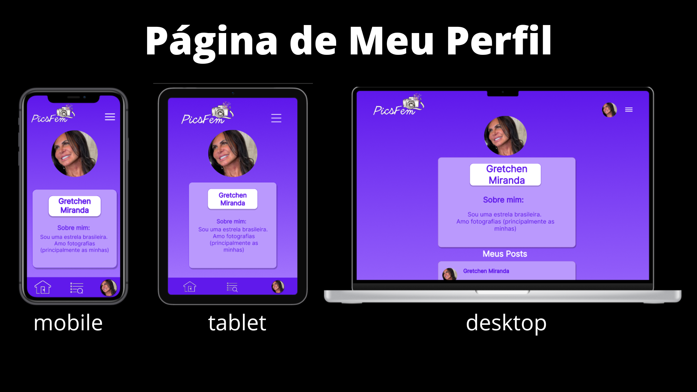

# PicsFem

## Índice

* [1. Resumo do projeto](#1-resumo-do-projeto)
* [2. Boilerplate](#2-boilerplate)
* [3. Definição de produto](#3-definição-de-produto)
* [4. Desenho da Interface de Usuário](#4-desenho-da-interface-de-usuário)
* [5. Histórias de usuário](#5-histórias-de-usuário)
* [6. Testes manuais e de usabilidade](#6-testes-manuais-e-de-usabilidade)
* [7. Sobre as Desenvolvedoras](#7-sobre-as-desenvolvedoras)

***

## 1. Resumo do projeto

PicsFem é uma rede social desenvolvida para mulheres amantes de fotografia. O seu objetivo principal é construir uma comunidade segura para que mulheres que amam fotografia possam: compartilhar conhecimentos e dicas; se apoiar; aperfeiçoar técnicas; além de debater e sanar dúvidas técnicas e não técnicas sobre o tema.

De acordo com pesquisas realizadas durante o desenvolvimento do projeto, relatou-se que mulheres fotógrafas possuem um grande desafio para adentrar no mercado de fotografia, pois este ainda é marjoritariamente masculino. Uma das futuras funcionalidades criadas seria a possibilidade de clientes poderem contratar mulheres fotógrafas para trabalhos freelancers através da PicsFem.

Um dos objetivos de aprendizagem do projeto era realizar entrevistas com os possíveis usuários. Para isso, utilizamos um form do google docs como ferramenta e neste criamos um formulário para compreender o perfil dos nossos possíveis usuários e analisar suas necessidades.
A priori, precisávamos conhecer o nosso público. Logo, iniciamos o questionário com perguntas como: nome, idade e como o usuário se identifica como pessoa. Dessa forma, foi identificado que nosso público seria majoritariamente feminino e em idades diversas.

Após a primeira identificação de nosso usuário, buscamos entender o seu perfil em relação ao propósito do site e a sua configuração pessoal, já que a aplicação web construída é voltada para o público amante de fotografia. Portanto, analisou-se as características vigentes e os possíveis interesses em utilizar o produto. Além disso, coletou-se: temas de interesse, relatos visando uma melhor usabilidade do produto e sugestões de possíveis implementações futuras.

Ao final da pesquisa, ficamos felizes com o resultado obtido, o qual foi muito importante para o direcionamento do desenvolvimento do projeto, além de nos dar uma melhor visão para implementações futuras na rede social, mediante possíveis investimentos.

## 2. Boilerplate

## 3. Definição de produto

PicsFem é uma rede social desenvolvida para mulheres amantes de fotografia. O seu objetivo principal é construir uma comunidade segura para que essas mulheres possam compartilhar conhecimento e ideias sobre o tema, além de poderem alavancar suas carreiras no mercado de fotografia, que ainda é marjoritariamente masculino.

## 4. Desenho da Interface de Usuário

### Protótipo de baixa fidelidade

### Protótipos de alta fidelidade

## 5. Histórias de usuário

### História 1: Eu como fotógrafa profissional, gostaria de me cadastrar e, em seguida, fazer o meu login, utilizando o meu gmail de forma prática, com o objetivo de otimizar o meu tempo.
Definimos que essa história estava pronta quando: finalizou-se a SPA; a página de login estava responsiva para todas as telas; construiu-se o teste da função de logar com o google; recebeu-se o code review de pelo menos uma parceira de equipe; finalizou-se os testes manuais e os testes de usabilidade; e realizou-se o deploy com o git tag.

### História 2: Eu como entusiasta de fotografias, gostaria de publicar dicas sobre edição de fotos com o objetivo de compartilhar meus conhecimentos com a comunidade. Porém, também, gostaria de editar ou removê-las depois, para melhorar a qualidade das publicações.

### História 3: Como PicsFemer, eu gostaria de interagir com as minhas outras colegas de comunidade através de likes, com o objetivo de me conectar melhor com elas.

### História 4: Como usuária de redes sociais, gostaria de poder sair da minha conta da PicsFem, com o objetivo de não deixar tantas contas de redes sociais abertas ao mesmo tempo. 

## 6. Testes manuais e de usabilidade
Após fazermos os testes manuais e de usabilidade, incorporamos os feedbacks dados pelos usuários, e fizemos as seguintes mudanças.
#### 6.1. Tiramos a fotografia do layout da página de login para os tablets, pois o usuário reclamou que o formulário não ficava tão legível, já que a imagem achatava o seu design.
#### 6.2. Colocamos o botão de voltar no formulário de criar conta, pois o usuário relatou que sentiu dificuldade em retornar para a página anterior, além de não ter ficado claro para ele como retornava.

## 7. Sobre as Desenvolvedoras
Projeto desenvolvido por Amanda Holanda [Linkedin](https://www.linkedin.com/in/amandaholanda/) | [GitHub](https://github.com/amanda-holanda), Isabella Lima [Linkedin]() | [GitHub]() & Gleyciane Macena [Linkedin]() | [GitHub]().
